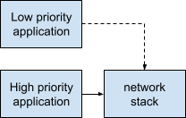
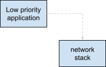

# Power framework in depth

## Observing without impacting or how to work opportunistically

Almost always there is an overhead power cost to turning hardware on. Often
there are types of work which are low priority and can be deferred so we don't
want to turn hardware on just for it, but we'd like to do the work if hardware
is available. Wireless data is a good example because turning on the radio is
relatively costly and so batching low priority transfers with high priority
transfers has advantages.

Power framework enables these scenarios with **opportunistic dependencies**
between power levels. Before talking about those, let's reveal that all
dependencies we've talked about previously are what we call **assertive
dependencies**. Leases on power levels with assertive dependencies activate the
power level(s) they depend on. This is just what we described in the example in
the [Coordination][coordination] section.

When a power level is leased and has **opportunistic dependencies** the power
level(s) depended upon are **not** activated. The lease on the power level can
only be fulfilled if something else, which has an _assertive_ dependency on the
power level(s) is also active.

Here we depict an opportunistic dependency with a dashed line. The low priority
application depends on the network stack, but its lease is only fulfilled when
the high priority application is around because the high priority application's
assertive dependency allows the low priority application's opportunistic
dependency to be met.

If the high priority application exits, the low priority application's
dependency is no longer fulfilled, which we depict here with a grey, dashed
line instead of a black dashed line.

Note: The ActivityGovernorListener talked about in
["Taking action on system suspend or resume"][taking_action] has similar
effects as opportunistic dependencies and in fact the same behavior as an
ActivityGovernorListener can be achieved by creating an element with an
opportunistic dependency on ExecutionState's Suspending power level.

The type of dependency (ie. opportunistic vs assertive) has **no impact on
ordering of level activation/deactivation**. The dependency type _only_ affects
if levels become active, not the ordering of these operations relative to the
level's dependencies and dependents. Thus, if the low priority application
starts an upload, it is informed when it should wrap up its work, and the
application gets to decide what to do before the network stack powers down.

Often opportunistic dependencies indicate **something is missing** from the
system design. In our example here the opportunistic dependency says the low
priority application can use the network stack if something high priority is
also using it, but it would be better if the system told the low priority
application when the low priority application _should_ be active. If the system
had an appropriate policy agent for this purpose the policy agent would take an
assertive dependency on the low priority application, thus telling the
application when to be active.

[coordination]: intro.md#coordination
[taking_action]: basic_suspend_resume.md#taking-action-on-system-suspend-or-resume
