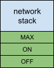
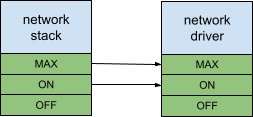

# Power framework in depth

"Wait," said the reader, "I don't know how anything _actually_ works!" Quite
right! Now we'll tie the abstract implementation of our goals to the concrete
one.

## Power DAG

In power framework our directed, acyclic graph ("DAG") is a DAG of
**power levels**. Each power level describes a state of a resource. A resource
is only ever at a _single_ power level.

For convenience, power levels for a resource are joined into an ordered set
called a **power element**. Many power elements have just two power levels, on
and off. The off level of a power element _must_ not have any dependencies.

Power elements _may_ have more than the on and off levels. In power framework a
higher order power level depends on any power level of lower order.

If we consider the network stack power element we could give it a "MAX" level.
"MAX" has all the requirements of the "ON" level (ie. that the network driver is
on), but perhaps "MAX" _also_ requires a special co-processor is online which
the network stack uses for high-throughput cryptographic functions.

Now, what if the network _driver_ also has a "MAX" level, which the "MAX" level
of the network _stack_ depends on?

We said that network stack's "MAX" level depends on network stack's "ON" level.
This means that indirectly network stack's "MAX" level depends on the network
driver's "ON" level **and** network stack's "MAX" level depends directly on the
network driver's "MAX" level. Does this mean power framework will tell the
network driver to be in both "ON" and "MAX" states? No. Power framework always
picks the power _level_ of a power _element_ which fulfills all current
requirements.

This is why it is useful to sometimes have more than two power levels and to
order them. If power elements could only ever have two states (ie. on and off)
this would create a burden for power resource owners to explicitly create
dependencies between elements representing resource states whereas with power
levels the dependence of higher order level on lower levels is implied and
there is less to configure.
