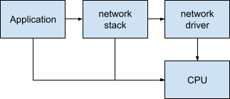
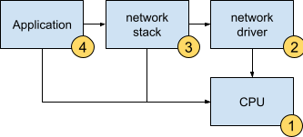
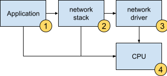

# Power framework in depth

## Running the DAG

In our previous sections we said things like "...the application asks power
framework to prepare the system...". An "ask" in this context means the
application requests a **lease**. A lease is for a power level.

Note: Due to implementation details of power framework a lease must be taken on
a power element that the lease requester owns. This requires the lease requester
to run a power element that may not have any behavior attached to it beyond
being the target of the lease.

Power levels above "OFF" levels are only active when there are active leases in
the system. If there are no active leases all power elements are at their
lowest level.

Let's consider the DAG in our example from the coordination section and assume
that we have power **elements with only two power levels**, which we simplify
here by not showing the levels.

Here we read the arrow direction as, for example, "Application _needs_ CPU".

If the application asks power framework to prepare the system for downloading,
then the power framework walks the DAG starting at the application and figures
out the order to create the valid system state.

The power framework examines system resources to see if they are in the right
state and tells them to change if they are not. In this case it talks to the
resource owner of the CPU, network driver, and network stack in that order and
finally the application when everything is ready. The power framework waits
for each dependency to report it is ready before asking its dependent to change
its state.

After the application receives the file contents it can tell the power
framework it no longer needs the system to be ready to download a file. The
power framework then walks the DAG again, informing resources they can power
down.

