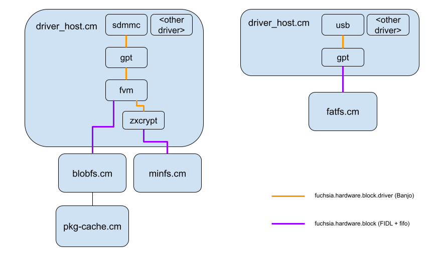
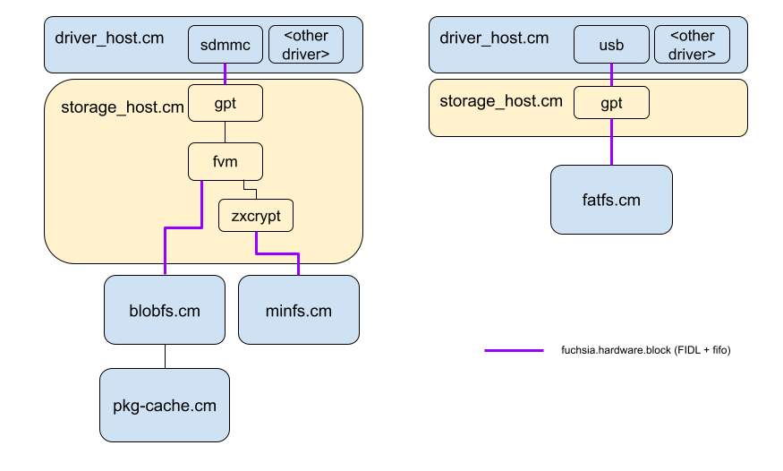

<!-- Generated with `fx rfc` -->
<!-- mdformat off(templates not supported) -->


# {{ rfc.name }}: {{ rfc.title }}
{# Fuchsia RFCs use templates to display various fields from _rfcs.yaml. View the #}
{# fully rendered RFCs at https://fuchsia.dev/fuchsia-src/contribute/governance/rfcs #}
<!-- SET the `rfcid` VAR ABOVE. DO NOT EDIT ANYTHING ELSE ABOVE THIS LINE. -->
<!-- mdformat on -->
<!-- This should begin with an H2 element (for example, ## Summary).-->

## Summary

Currently, block devices are implemented in the Driver Framework in a layered
manner.  Low-level drivers which actually interact with hardware (e.g. sdmmc,
virtio) implement the internal `fuchsia.hardware.block.driver` protocol, and
upper-level drivers (e.g. GPT, FVM, zxcrypt) interact with this protocol and
provide higher level functionality on top of these drivers (including the public
`fuchsia.hardware.block` and `fuchsia.hardware.block.partition` protocols).  We
propose moving all upper-layer block drivers into a new component, the
**storage-host**, leaving only low-level drivers in the Driver Framework.

## Motivation

The primary goal of this change is to decouple the storage stack from Devfs and
the driver framework, supporting the Driver Framework team's efforts to remove
Devfs (and more broadly of migrating the driver stack to Driver Framework V2).

Currently the storage stack widely depends on Devfs for discovery and
topological access to block devices.  Removing this dependency requires a
significant amount of refactoring of the storage stack to use an alternative
mechanism to Devfs (which, at the time of writing this document, have not yet
been designed).  Since new APIs will need to be created and the storage stack
will need to be changed to use them, it is a natural time to reconsider where
these APIs are actually implemented as well.

Arguably, the upper layer block devices such as GPT are not device drivers in
the true sense; they don't interact with hardware, they interact with a
lower-layer block device.  In other words, the driver framework is optimized for
different use-cases than these upper-layer block devices.  The Storage stack has
consistently been an unusual client of the Driver Framework (e.g. our heavy
usage of topological paths in Devfs), and it doesn't seem that there is any
benefit for either the Driver Framework or the storage team to maintain this
mismatch.

Beyond accelerating the Driver Framework team's efforts to deprecate Devfs,
there are a number of other benefits that come from migrating these upper layer
block devices to storage-host:

* Increasing the storage team's engineering velocity by simplifying and
  consolidating our tech stack to familiar languages (Rust) and frameworks
  (regular non-driver components),
* Enabling performance optimizations that require cross-stack work (such as
  possibly co-locating filesystems with upper-layer block drivers, or API
  changes such as those needed for I/O priorities),
* Allowing the storage team to maintain control over which components access
  block devices, which should be mediated by storage policy (rather than access
  to /dev/class/block).
* We save the work of porting these drivers to Driver Framework V2.

## Stakeholders

_Facilitator:_

* hjfreyer@google.com

_Reviewers:_

* garratt@google.comm
* csuter@google.com
* curtisgalloway@google.com
* surajmalhotra@google.com

_Consulted:_

* The Driver Framework team was consulted.

_Socialization:_

This RFC was socialized with the Driver Framework team ahead of this
publication.

## Requirements

This change MUST be transparent to the rest of Fuchsia; we expect no functional
changes as part of this work.

This change SHOULD NOT induce any significant regressions in performance,
memory, or storage usage.

## Design

The storage-host component will manage the partitions and nested block devices
of a physical block device.  It will be implemented in Rust.

For illustrative purposes, the boot flow is described for a system which has a
GPT-formatted block device.  Storage-host will be able to handle other
partitioning schemes such as MBR and FVM in a similar manner.

Fshost currently listens for block devices from the Driver Framework, detects
their format, and determines which block device driver to bind.  For example,
fshost will launch the `gpt` device driver when a GPT-formatted device is
detected.  The change in fshost is straightforward: instead of launching the
`gpt` device driver, fshost will instead hand off the device to storage-host.

storage-host will parse the partition table out of the GPT, and export a
`fuchsia.hardware.block.partition.Partition` service for each partition.  These
services will be made available in a `partitions` directory exported by
storage-host.  This directory serves as a replacement for the dev-topological
paths from Devfs, allowing hierarchical discovery and access of nested
partitions.

Fshost will watch for devices published into `partitions` and perform its usual
matching, which may include launching filesystems.   Nested partitions are valid
(e.g. FVM within GPT), and in this case, fshost will simply ask storage-host to
mount and unnest the given partition.

The protocols which filesystems and other clients use to perform block I/O don't
need to change as part of this, as storage-host will implement the same
protocols that the drivers did.  That said, we may choose to change these
protocols for other reasons, such as improving performance.

Clients which currently use Devfs for discovering and connecting to block
devices will need to be ported to using `partitions`.  Many usages are already
mediated by fshost or the paver, and it probably makes sense to move the long
tail of clients to using mediated access via fshost, so we have tighter control
over the usage of block devices.  For example, we can expose an API in fshost to
access a particular partition, rather than giving blanket access to all block
devices.  The `partitions` directory will only be used in-tree and should have
limited set of clients, so we have flexibility to change it as needed.

The back-and-forth relationship between fshost and storage-host (fshost passes
the block devices to storage-host, storage-host binds to partitions and passes
back the nested block devices to fshost) might seem unusual, but there are two
benefits.  Pragmatically, it speeds up implementation of storage-host, since
very few changes in fshost are needed.  It also maintains a separation of
responsibility: fshost implements storage policy (which filesystems to bind,
which block devices to mount, etc), and storage-host helps to execute that
policy by hosting nested block devices.  The circular relationship could be
rearchitected later if it makes sense to do so.

Note that there will be no changes to early boot, i.e. loading bootfs out of the
ZBI.  That part of the boot sequence precedes launching fshost and therefore is
unchanged by this proposal.

### Multiple storage-host instances

Although there is no need at this time, we will avoid baking in assumptions that
there is a single storage-host instance on the system.  For example, we might
want a separate storage-host instance for the embedded storage device and a
pluggable USB device, to maintain some degree of isolation between the two
storage stacks to enhance security.  Or we may want to have separate
storage-host instances running different formats, e.g. GPT and FVM, to enhance
isolation.

{:#fig1}

**Figure 1: Current Architecture.**

{:#fig2}

**Figure 2: Proposed Architecture.**

## Implementation

This change can be done incrementally and on a per-board basis as we migrate
various drivers over.

For example, the vim3 configuration only requires migrating the GPT driver, so
we can implement that first and enable storage-host on vim3 once the GPT driver
has been ported.  Smart products require the FVM and zxcrypt; these will be
implemented later.

We will need to ensure that clients can temporarily access block devices from
either devfs or storage-host, which is straightforward as we plan to use a
similar directory-oriented interface for discovery.

We will gate the usage of storage-host on the `fuchsia.fshost.StorageHost`
configuration capability, and enable it when a particular product/board
configuration is ready to be switched over.

Once all usages are switched over and deemed stable, we can remove the
transitional logic to complete the migration.

storage-host will be implemented as a monolithic Rust binary.  If it becomes
necessary (e.g. to reduce binary bloat), we could separate out functionality
(e.g. zxcrypt) into libraries and dynamically link them in as needed on a
per-product basis, but in the interest of simplicity we will start with a
monolithic binary.

Note that since there are no functional differences between storage-host and the
equivalent Driver Framework based implementation, these changes can be safely
reverted if issues arise.

Note that there are also a variety of host tools accompanying FVM and GPT.  We
don't plan to port these to Rust, as they are stable, independent of the
drivers, and there is no incentive to change them at this time.

## Performance

We believe this change will be performance-neutral on configurations which do
not depend on FVM and zxcrypt.  Although there is now a new component between
the filesystem and the block device driver, this component can get out of the
way with some simple API changes (e.g. storage-host can broker a windowed view
of the underlying block device to the filesystem, and the filesystem can then
communciate directly to the underlying block driver).

For FVM and zxcrypt, storage-host needs to intercept each request and modify it
in transit, which will come with increased latency compared to the current
Driver Framework implementation.  For FVM, this is necessary to map virtual
offsets to physical offsets, and for zxcrypt, this is necessary for encryption.

This increased latency occurs because the request needs to be pulled off of the
block FIFO by storage-host and re-queued on the underlying FIFO.  Note that the
Driver Framework implementation still needs to intercept, modify, and re-queue
each request, but the driver-to-driver communication happens over a Banjo
protocol (fuchsia.hardware.block.driver.Block) which uses a more efficient
transport mechanism when both drivers are co-located. In other words, the
latency arises due to an additional process hop through storage-host.

We think we can address this in a few ways (which are made easier or feasible
with storage-host):

* It's easier to introduce concurrency in Rust, so we may be able to improve
  throughput by pipelining or parallelizing work.
* Blobfs uses an external decompressor for increased security, which adds a
  round-trip to file reads.  That could be moved to storage-host and done in
  tandem with the I/O requests, cancelling out the additional hop introduced by
  storage-host.  (Blobfs would be no worse off from a security perspective if
  that were the case, as Blobfs does not assume the block device itself is
  trustworthy; the main goal from a security perspective is avoiding in-process
  decompression which could compromise the Blobfs process.  Other filesystems,
  i.e. Minfs, don't have the same ability to verify data that Blobfs does, so
  could be tampered with if storage-host became compromised; we'd have to weigh
  the performance and security tradeoffs for this optimization).

Looking forward, we expect that we will be able to make changes more easily in
storage-host, which will help us with future performance optimization work.  For
example, we may eventually need to introduce I/O priorities, which will require
changes across the entire stack.  This becomes easier for Storage to do with a
consolidated codebase in a language and environment that we can work much faster
in.

## Backwards Compatibility

Since we are only modifying in-tree code and APIs, there are no backwards
compatibility concerns with this change.

## Security considerations

The reimplementation of zxcrypt will require a security review since it is a
security-sensitive service.

This change will otherwise enhance security in a few ways:

* Drivers will be implemented in Rust rather than C++, mitigating memory
  corruption vulnerabilities.
* We will have an opportunity to audit and reduce access to block devices via
  /dev/class/block or dev-topological, since all of these usages will need to be
  migrated.

One point to be aware of is that this proposal will involve some changes to the
security domains that currently exist.  We can consider components that are
hosted in the same process as being in a single security domain; compromising
one implies compromise of the other.  Components that communicate with each
other over FIDL or other IPC mechanisms have a greater degree of isolation from
each other (not that this implies immunity to attacks).  This proposal increases
isolation (separating storage device management from other co-located drivers),
but we think it is valuable to remain flexible with deciding appropriate
isolation boundaries, if it becomes necessary for performance to co-locate
pieces of software.  Refer to the diagrams in the Design section.

## Privacy considerations

N/A.

## Testing

The existing fshost test suite serves as a solid foundation for us to validate
these changes, as these tests exercise the end-to-end flow of detecting and
binding to block devices.

We should take this opportunity to develop more robust block stack tests as
well, which we can use to validate that the behaviour between the two
implementations are identical.

## Documentation

The lower layers of Storage are historically under-documented, and this is a
good opportunity to improve that with some high-level architectural
documentation.  Storage is generally opaque to end-developers, but it is of
interest for systems developers and other Fuchsia teams which integrate with
Storage.

## Drawbacks, alternatives, and unknowns

### Drawbacks

We lose the ability to co-locate these upper layer drivers with the lowest level
storage drivers in this change, since the lowest level drivers will rightfully
stay in Driver Framework.  That said, we don't think this is an issue, as we've
only moved the boundary under which the storage stack lives in the Driver
Framework, and that boundary is unlikely to ever include the entire storage
stack (including filesystems), so there will always be some boundary between the
parts of the storage stack that life in DF and those which do not.

This change makes it harder to implement OOT storage drivers, but this is
already not something we intend to support; we expect that all storage-related
code will remain in-tree for the foreseeable future.

We will initially statically compile storage-host with all available
formats, whereas in the old Driver Framework, drivers are dynamically loaded and
only those which the product uses are included.  As discussed above, we don't
think this is an issue, and we can address it with dynamic linking later if
desired.

### Alternatives

The obvious alternative is to simply not do this change, leaving upper-layer
drivers in the Driver Framework.  Note, however, that this doesn't mean that
there is no work to be done.  We would still need to:

* Migrate upper-layer block drivers to DFv2.
* Design a new interface for discovering and connecting to block devices, in
  collaboration with the Driver Framework team.
* Port all clients to using this new interface instead of dev-topological.

In other words, the integrational work in both cases has the same breadth and
scope.  The additional work required for this proposal is to reimplement the
drivers in Rust, rather than porting them to DFv2.  None of the drivers are
particularly complicated -- we were able to create a working GPT prototype in
about a week -- so this is a modest additional cost, and comes with the benefits
described above.

Another option would be to wait for the introduction of Rust-based drivers to
Driver Framework, and port the existing drivers to Rust then, keeping them in
the Driver Framework.  However, the timelines don't line up for that.  The
deprecation of Devfs has a target date of EOY 2024, and there's no committed
timeline for stable support of Rust drivers, so we will have to deal with the
Devfs deprecation anyways; we might as well also receive the other benefits of
storage-host described above at the same time.

## Prior art and references

N/A.
