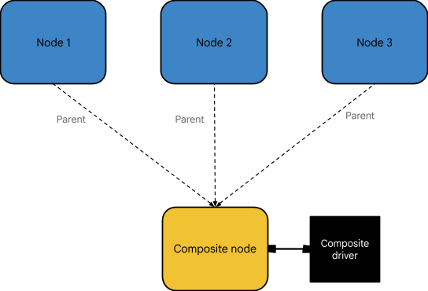
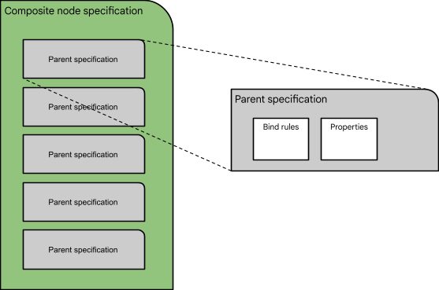
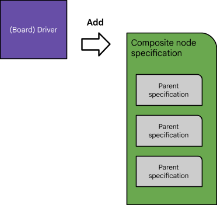
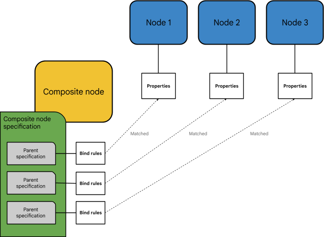
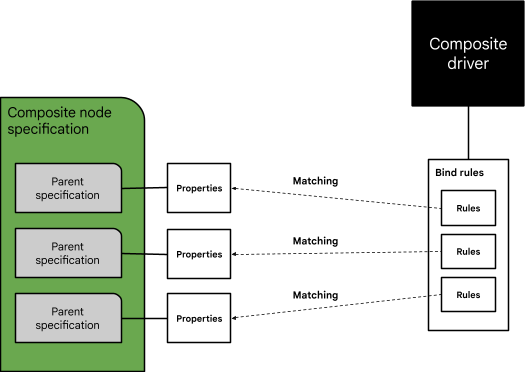
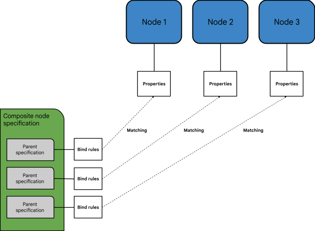
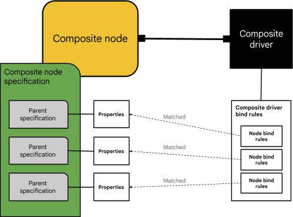

# Create a composite node

This tutorial explains how to create a [composite node][composite-node-concepts]
in a Fuchsia system for a composite driver.

A [**composite node specification**][composite-node-spec] is a mechanism used
to describe a composite node in a Fuchsia system. A
[**composite node**][composite-node] is a node that has multiple parent nodes.
A [**composite driver**][composite-driver] is a driver that binds to a
composite node and uses resources managed by multiple parent nodes in the
system.

To create a composite node for a composite driver, you need to perform the
following tasks:

- **Create a composite node specification**
- **Write a composite driver's bind rules** (to match the composite node
  specification)

The steps are:

1. [Prepare parent specifications](#prepare-parent-specifications).
2. [Create a composite node specification](#create-a-composite-node-specification).
3. [Define bind rules for the composite driver](#define-bind-rules-for-the-composite-driver).

For troubleshooting issues, see
[Debugging composite driver issues](#debugging-composite-driver-issues).

## Understanding composite node concepts {:#understanding-composite-node-concepts}

A [**composite node**][composite-node] is a node with multiple parents. A composite
node acts as a central point of contact for multiple parent nodes, enabling access
to the resources managed by these parent nodes. When a driver is bound to
a composite node, the composite driver can access the combined resources provided
by the parent drivers.



**Figure 1**. A composite node has access to multiple parent nodes and their
resources.

Before you begin, familiarize yourself with the development concepts below:

- [Key background concepts](#key-background-concepts)
- [What is a composite node specification?](#what-is-a-composite-node-specification)
- [How does the driver framework create a composite node in a Fuchsia system?](#how-does-df-create-a-composite-node-in-a-fuchsia-system)
- [How does the driver framework match a composite driver to a composite node?](#how-does-df-match-a-composite-driver-to-a-composite-node)
- [How do bind rules work?](#how-do-bind-rules-work)

### Key background concepts {:#key-background-concepts}

This tutorial assumes familiarity with the following concepts related to
Fuchsia drivers:

- [**Driver binding**][driver-bindings]: The process of matching drivers to nodes
  within a Fuchsia system.
- [**Composite nodes**][composite-node-concepts]: A node with multiple parent nodes,
  enabling access to multiple resources in a Fuchsia system.
- [**Driver framework (DFv2)**][driver-concepts]: A new framework that manages drivers
  and nodes in Fuchsia.

### What is a composite node specification? {:#what-is-a-composite-node-specification}

A [**composite node specification**][composite-node-spec] is a mechanism for
creating a composite node. It describes the nodes that can serve as parent nodes
to the composite node and an appropriate composite driver that can bind to the
composite node.

Unlike a component manifest (`.cml`) and bind rules (`.bind`), a composite node
specification is **not a file**. It is an object that needs to be constructed
and added (using the `CompositeNodeManager` protocol) by a driver (to be exact,
by the driver's source code) loaded in a Fuchsia system.



**Figure 2**. A composite node specification is a collection of parent
specifications.

A composite node specification comprises a set of parent specifications, each
representing the criteria of a parent node of the composite node. A set of
parent specifications serve the following purposes:

- **Describe nodes** that are parent nodes of this composite node.
- **Provide properties** for identifying a composite driver.

Each parent specification in a composite node specification contains the
following:

- **Bind rules**: The bind rules used to match this parent specification to a
  node in the topology.
- **Properties**: A part of the key-value pairs applied in the composite node's
  matching process for finding a composite driver. (They follow the same format
  as [node properties][node-properties].)

### How does the driver framework create a composite node in a Fuchsia system? {:#how-does-df-create-a-composite-node-in-a-fuchsia-system}

When a composite node specification is introduced
to the system, the following events take place:

1. A composite node specification is added to the driver framework by a driver
   loaded in a Fuchsia system, which is typically a [board driver][board-driver].

   

1. The [driver manager][driver-manager] asks the [driver index][driver-index] to
   search for a matching composite driver based on the composite node specification.

   A composite driver whose bind rules can satisfy all the **properties** of the
   parent specifications in this composite node specification is matched. (See
   [How does the driver framework match a composite driver to a composite node?](#how-does-df-match-a-composite-driver-to-a-composite-node))

   

1. Once a composite driver is found, the driver manager asks the driver index to
   search for nodes in the system based on the composite node specification.

   Nodes whose node properties can satisfy the **bind rules** provided by the
   parent specifications in the composite node specification are matched. Each
   matching node becomes a parent node of the newly created composite node in
   step 3.

   

1. After all parent specifications have a match, the driver manager creates a
   composite node using the matched nodes as parents and finally binds the
   composite driver (matched in step 1) to the newly created composite node.
   (The composite node provides the primary node and node names.)

   

### How does the driver framework match a composite driver to a composite node? {:#how-does-df-match-a-composite-driver-to-a-composite-node}

A composite driver's matching process is done by applying the composite driver's
**bind rules** to the **properties** provided by the parent specifications in
a composite node specification. (Notice that this is different from applying the
parent specifications' bind rules to match nodes in the topology.)

For example, these bind rules are from a composite driver:

```none {:.devsite-disable-click-to-copy}
composite focaltech_touch;

using fuchsia.gpio;
using fuchsia.hardware.i2c;
using fuchsia.i2c;

primary node "i2c" {
  fuchsia.hardware.i2c.Service == fuchsia.hardware.i2c.Service.ZirconTransport;
  fuchsia.BIND_I2C_ADDRESS == fuchsia.i2c.BIND_I2C_ADDRESS.FOCALTECH_TOUCH;
}

node "gpio-int" {
  fuchsia.BIND_PROTOCOL == fuchsia.gpio.BIND_PROTOCOL.DEVICE;
  fuchsia.gpio.FUNCTION == fuchsia.gpio.FUNCTION.TOUCH_INTERRUPT;
}
```

Using these bind rules, a matching composite node specification requires a
parent specification with properties that match `i2c` and another parent
specification with properties that match `gpio-int`.

A match between a composite driver and a composite node (specification) is
successful if the following conditions are met:

- All parent specifications must match with a node in the composite driver's
  bind rules.

- All **non-optional** nodes in the composite driver's bind rules must match
  with a parent specification.

  For example, these bind rules from a composite driver includes an optional node:

  ```none {:.devsite-disable-click-to-copy}
  composite virtio_input;

  using fuchsia.acpi;
  using fuchsia.hardware.pci;
  using fuchsia.pci;

  primary node "pci" {
      fuchsia.hardware.pci.Service == fuchsia.hardware.pci.Service.ZirconTransport;
      fuchsia.BIND_PCI_VID == fuchsia.pci.BIND_PCI_VID.VIRTIO;
      fuchsia.BIND_PCI_DID == fuchsia.pci.BIND_PCI_DID.VIRTIO_DEV_TYPE_INPUT;
  }

  optional node "acpi" {
      fuchsia.BIND_PROTOCOL == fuchsia.acpi.BIND_PROTOCOL.DEVICE;
  }
  ```

  (**Source**: [`virtio_input.bind`][virtio-input-bind])

Nodes do not need to be matched in the order listed in the composite driver's
bind rules.

However, matching cannot be ambiguous, that is:

- Each parent specification must correspond with only one node in the composite
  driver's bind rules.
- Each node in the composite bind rules must match with at most one parent
  specification. (Optional nodes may not match with any parent specifications.)

If an ambiguous case occurs, the driver manager will print a warning message in
the logs. (Currently, the match still happens, but it will be disallowed in the
future. See [this related ticket][ticket-01].)



**Figure 3**. Each parent specification's bind rules are used to find a parent
node of the composite node.



**Figure 4**. A composite driver's bind rules are matched against a composite
node's properties, which are collectively provided by parent specifications in a
composite node specification.

### How do bind rules work? {:#how-do-bind-rules-work}

The bind rules in a parent specification provide a list of **accepted** and
**rejected** property values. For a node to satisfy the bind rules, its node
properties must contain all the accepted node property values and none of the
rejected ones.

For example, a parent specification can contain the following bind rules:

- Accept `fuchsia.BIND_PROTOCOL` values `15` and `17`.
- Reject `fuchsia.BIND_PLATFORM_DEV_VID` values `Intel`.

Using these bind rules, a node can be matched only if it contains a value of
`15` or `17` for the `fuchsia.BIND_PROTOCOL` property and doesn't have the
`Intel` value for the `fuchsia.BIND_PLATFORM_DEV_VID` property.

## 1. Prepare parent specifications {:#prepare-parent-specifications}

You first need to prepare the parent specifications that will make up a
[composite node specification](#what-is-a-composite-node-specification).

To prepare parent specifications, the steps are:

1. [Define bind rules in parent specifications](#define-bind-rules-in-parent-specifications).
1. [Define properties in parent specifications](#define-properties-in-parent-specifications).

### 1. Define bind rules in parent specifications {:#define-bind-rules-in-parent-specifications}

Bind rules are used to find and match nodes in the topology according to parent
specifications. A node's properties are evaluated against the bind rules in a
parent specification. If they match, the node becomes a parent of a composite
node.

#### Process of writing bind rules {:#process-of-writing-bind-rules}

The process for writing bind rules for a composite node's parent nodes is
similar to the process described in the
[Bind rules tutorial][bind-rules-tutorial]. To determine the bind rules,
you first need to identify the properties of each parent node that you want
to bind to.

To view the properties of every node in the node topology, you can use the
following `ffx` command:

```posix-terminal
ffx driver list-devices -v
```

This command prints entries similar to the following:

```none {:.devsite-disable-click-to-copy}
Name     : i2c-1-56
Topo Path: sys/platform/i2c-0/aml-i2c/i2c/i2c-1-56
Driver   : fuchsia-boot:///#driver/i2c.so
Flags    : MUST_ISOLATE | BOUND
Proto    : ZX_PROTOCOL_I2C (24)
3 Properties
[ 1/  3] : Key fuchsia.BIND_I2C_BUS_ID        Value 0x000001
[ 2/  3] : Key fuchsia.BIND_I2C_ADDRESS       Value 0x000038
[ 3/  3] : Key "fuchsia.hardware.i2c.Service" Value "fuchsia.hardware.i2c.Service.ZirconTransport"
```

The example entry above shows the following node properties for the `i2c-1-56`
node:

- `fuchsia.I2C_BUS_ID` = `0x000001undefined`
- `fuchsia.I2C_ADDRESS` = `0x000038`
- `fuchsia.hardware.i2c.Service` =
  `fuchsia.hardware.i2c.Service.ZirconTransport`

To see which property values are acceptable, you can look up the bind libraries
in the Fuchsia codebase (for example, in the [`src/devices/bind`][bind-dir]
directory). In this example, since the node is an I2C node, the property values
are found in the [`fuchsia.i2c`][fuchsia-i2c] bind library as shown below:

```none {:.devsite-disable-click-to-copy}
extend uint fuchsia.BIND_I2C_BUS_ID {
  I2C_A0_0 = 0,
  I2C_2 = 1,
  I2C_3 = 2,
};

extend uint fuchsia.BIND_I2C_ADDRESS {
  BACKLIGHT = 0x2C,
  ETH = 0x18,
  FOCALTECH_TOUCH = 0x38,
  AMBIENTLIGHT = 0x39,
  AUDIO_CODEC = 0x48,
  GOODIX_TOUCH = 0x5d,
  TI_INA231_MLB = 0x49,
  TI_INA231_SPEAKERS = 0x40,
  TI_INA231_MLB_PROTO = 0x46,
};
```

In addition to the bind libraries in the Fuchsia codebase, you can also generate
bind libraries from FIDL libraries. In the example above, this is where the
property for the `fuchsia.hardware.i2c.Service` key and its value
`fuchsia.hardware.i2c.Service.ZirconTransport` come from. (For more information,
see [Generated bind libraries][generated-bing-libraries].)

Using the property values found in the bind library, you can remap the node
properties as shown below:

- `fuchsia.BIND_I2C_BUS_ID` = `fuchsia.i2c.BIND_I2C_BUS_ID.I2C_2`
- `fuchsia.BIND_I2C_ADDRESS` = `fuchsia.i2c.BIND_I2C_ADDRESS.FOCALTECH_TOUCH`
- `fuchsia.hardware.i2c.Service` =
  `fuchsia.hardware.i2c.Service.ZirconTransport`

You can access these bind library values in your driver source code through its
generated libraries. (For more information, see the
[Bind libraries codegen tutorial][bind-libraries-codegen-tutorial].)

The bind rules that match these properties are defined as shown below:

```none {:.devsite-disable-click-to-copy}
accept fuchsia.hardware.i2c.Service { fuchsia.hardware.i2c.Service.ZirconTransport }
accept BIND_I2C_BUS_ID { fuchsia.i2c.BIND_I2C_BUS_ID.I2C_2 }
accept BIND_I2C_ADDRESS { fuchsia.i2c.BIND_I2C_ADDRESS.FOCALTECH_TOUCH }
```

#### Defining bind rules in DFv1 {:#defining-bind-rules-in-dfv1}

In DFv1, composite node specifications are written using the DDKTL
(Device Driver Kit Template Library). The functions to write the bind rules are
in [`composite-node-spec.h`][composite-node-spec-h].

With the DDK library and bind libraries codegen values, we can write the
following:

```none {:.devsite-disable-click-to-copy}
const ddk::BindRule kI2cBindRules[] = {
    ddk::MakeAcceptBindRule(bind_fuchsia_hardware_i2c::SERVICE,
                            bind_fuchsia_hardware_i2c::SERVICE_ZIRCONTRANSPORT),
    ddk::MakeAcceptBindRule(bind_fuchsia::I2C_BUS_ID,
                            bind_fuchsia_i2c::BIND_I2C_BUS_ID_I2C_2),
    ddk::MakeAcceptBindRule(bind_fuchsia::I2C_ADDRESS,
                            bind_fuchsia_focaltech_platform::BIND_I2C_ADDRESS_TOUCH),
};
```

#### Defining bind rules in DFv2 {:#defining-bind-rules-in-dfv2}

In DFv2, composite node specifications are defined by the `CompositeNodeSpec`
protocol from [`composite_node_spec.fidl`][composite-node-spec-fidl] in the
`fuchsia.driver.framework` FIDL library. The
[`composite_node_spec.h`][composite-node-spec-h-sdk] library in the
`sdk/lib/driver/component/cpp` directory can be used to simplify defining the
bind rules.

Using the `CompositeNodeSpec` library and bind libraries codegen values, we can
write the following:

```none {:.devsite-disable-click-to-copy}
auto i2c_bind_rules = std::vector {
    MakeAcceptBindRule(bind_fuchsia_hardware_i2c::SERVICE,
                       bind_fuchsia_hardware_i2c::SERVICE_ZIRCONTRANSPORT),
    MakeAcceptBindRule(bind_fuchsia::I2C_BUS_ID,
                       bind_fuchsia_i2c::BIND_I2C_BUS_ID_I2C_2),
    MakeAcceptBindRule(bind_fuchsia::I2C_ADDRESS,
                       bind_fuchsia_focaltech_platform::BIND_I2C_ADDRESS_TOUCH),
};
```

### 2. Define properties in parent specifications {:#define-properties-in-parent-specifications}

In addition to defining the bind rules for nodes, in parent specifications, you
need to define the properties that will be used in finding a composite driver.

These properties are key-value pairs that are used to match a parent
specification to a composite driver's bind rules. They are the same thing as
node properties, following the same format. The property key can be
integer-based or string-based while the property value can be an integer,
boolean, string or enum type.

#### Defining properties in DFv1 {:#defining-properties-in-dfv1}

In DFv1, composite node specifications are written using [DDKTL][ddktl] and the
functions to write the bind rules are in
[`composite-node-spec.h`][composite-node-spec-h]. You can
define properties using the DDK library and bind libraries codegen values as
shown below:

```none {:.devsite-disable-click-to-copy}
const device_bind_prop_t kI2cProperties[] = {
    ddk::MakeProperty(bind_fuchsia_hardware_i2c::SERVICE,
                      bind_fuchsia_hardware_i2c::SERVICE_ZIRCONTRANSPORT),
    ddk::MakeProperty(bind_fuchsia::I2C_ADDRESS,
                      bind_fuchsia_focaltech_platform::BIND_I2C_ADDRESS_TOUCH),
};
```

#### Defining properties in DFv2 {:#defining-properties-in-dfv2}

In DFv2, composite node specifications are written for
[`composite_node_spec.fidl`][composite-node-spec-fidl] in the
`fuchsia.driver.framework` FIDL library. The
[`node_add_args.h`][node-add-args-h] library in `//sdk/lib/driver/component/cpp`
can be used to simplify defining properties. You can define properties using the
`CompositeNodeSpec` library and bind libraries codegen values as shown below:

```none {:.devsite-disable-click-to-copy}
auto i2c_properties[] = std::vector {
    ddk::MakeProperty(bind_fuchsia::I2C_ADDRESS,
                      bind_fuchsia_focaltech_platform::BIND_I2C_ADDRESS_TOUCH),
};
```

## 2. Create a composite node specification {:#create-a-composite-node-specification}

Creating a composite node specification involves defining and adding a set of
parent specifications to the driver manager.

A composite node specification is added to the driver framework by a driver
loaded in a Fuchsia system, which is typically a board driver. (For more
information on this process, see
[How does the driver framework create a composite node in a Fuchsia system?](#how-does-df-create-a-composite-node-in-a-fuchsia-system))

### Adding a composite node specification in DFv1 {:#adding-a-composite-node-specification-in-dfv1}

In DFv1, a driver can add composite node specifications through [DDKTL][ddktl]
with the `DdkAddCompositeNodeSpec()` function.

The driver must first define a `CompositeNodeSpec` object in the
[`composite-node-spec.h`][composite-node-spec-h-ddktl] library. Using the example
bind rules and properties in the previous section, you can define
a `CompositeNodeSpec` object with an I2C parent specification as following:

```none {:.devsite-disable-click-to-copy}
const ddk::BindRule kI2cBindRules[] = {
    ddk::MakeAcceptBindRule(bind_fuchsia_hardware_i2c::SERVICE,
                            bind_fuchsia_hardware_i2c::SERVICE_ZIRCONTRANSPORT),
    ddk::MakeAcceptBindRule(bind_fuchsia::I2C_BUS_ID,
                            bind_fuchsia_i2c::BIND_I2C_BUS_ID_I2C_2),
    ddk::MakeAcceptBindRule(bind_fuchsia::I2C_ADDRESS,
                            bind_fuchsia_focaltech_platform::BIND_I2C_ADDRESS_TOUCH),
};

const device_bind_prop_t kI2cProperties[] = {
    ddk::MakeProperty(bind_fuchsia_hardware_i2c::SERVICE,
                      bind_fuchsia_hardware_i2c::SERVICE_ZIRCONTRANSPORT),
    ddk::MakeProperty(bind_fuchsia::I2C_ADDRESS,
                      bind_fuchsia_focaltech_platform::BIND_I2C_ADDRESS_TOUCH),
};

auto spec = ddk::CompositeNodeSpec(kI2cBindRules, kI2cProperties);
```

Any additional nodes can be added with the `AddParentSpec()` function. For
instance, if we want to add a parent specification for a GPIO interpret pin, we
can write the following:

```none {:.devsite-disable-click-to-copy}
const ddk::BindRule kGpioInterruptRules[] = {
    ddk::MakeAcceptBindRule(bind_fuchsia::PROTOCOL,
                            bind_fuchsia_gpio::BIND_PROTOCOL_DEVICE),
    ddk::MakeAcceptBindRule(bind_fuchsia::GPIO_PIN,
                bind_fuchsia_amlogic_platform_s905d2::GPIOZ_PIN_ID_PIN_4),
};

const device_bind_prop_t kGpioInterruptProperties[] = {
    ddk::MakeProperty(bind_fuchsia::PROTOCOL,
                      bind_fuchsia_gpio::BIND_PROTOCOL_DEVICE),
    ddk::MakeProperty(bind_fuchsia_gpio::FUNCTION,
                      bind_fuchsia_gpio::FUNCTION_TOUCH_INTERRUPT)};

desc.AddParentSpec(kGpioInterruptRules, kGpioInterruptProperties);
```

Once the `CompositeNodeSpec` object is ready, you can add it with
`DdkAddCompositeNodeSpec()`, where `spec` is an object containing the composite
node specification, for example:

```cpp {:.devsite-disable-click-to-copy}
auto status = DdkAddCompositeNodeSpec("ft3x27_touch", spec);
```

Since a `CompositeNodeSpec` object follows the builder pattern, this can be
simplified to:

```cpp {:.devsite-disable-click-to-copy}
auto status =
     DdkAddCompositeNodeSpec("ft3x27_touch",
          ddk::CompositeNodeSpec(kFocaltechI2cRules, kFocaltechI2cProperties)
              .AddParentSpec(kGpioInterruptRules, kGpioInterruptProperties)
              .set_metadata(metadata);
```

### Adding a composite node specification in DFv2 {:#adding-a-composite-node-specification-in-dfv2}

In DFv2, we use the `CompositeNodeManager` protocol from the
`fuchsia.driver.framework` FIDL API to add a composite node specification:

```cpp {:.devsite-disable-click-to-copy}
@discoverable
protocol CompositeNodeManager {
    /// Add the given spec to the driver manager.
    AddSpec(CompositeNodeSpec) -> () error CompositeNodeSpecError;
};
```

### Adding a composite node specification to the platform bus {:#adding-a-composite-node-specification-to-the-platform-bus}

If the composite node needs a parent from a node on the platform bus, then the
board driver can add the composite node specification through the
[`platform_bus.fidl`][platform-bus-fidl] API. This applies to both DFv1 and DFv2.

```cpp {:.devsite-disable-click-to-copy}
/// Adds a composite node specification to the bus. This will add a platform device specified
/// by |node| and insert a node into the composite node specification that matches the device.
AddCompositeNodeSpec(struct {
    node Node;
    spec fuchsia.driver.framework.CompositeNodeSpec;
}) -> () error zx.Status;
```

The platform bus API uses the same `CompositeNodeSpec` struct defined in
[`composite_node_spec.fidl`][composite-node-spec-fidl].

For example, say we defined the following composite node specification:

```cpp {:.devsite-disable-click-to-copy}
std::vector<fuchsia_driver_framework::BindRule> bind_rules = {
    fdf::MakeAcceptBindRule(bind_fuchsia_hardware_i2c::SERVICE,
        bind_fuchsia_hardware_i2c::SERVICE_ZIRCONTRANSPORT),
    fdf::MakeAcceptBindRule(bind_fuchsia::I2C_ADDRESS,
        bind_fuchsia_i2c::BIND_I2C_ADDRESS_BACKLIGHT),
};

std::vector<fuchsia_driver_frameowork::Node> properties = {
    fdf::MakeProperty(bind_fuchsia_hardware_i2c::SERVICE,
        bind_fuchsia_hardware_i2c::SERVICE_ZIRCONTRANSPORT),
    fdf::MakeProperty(bind_fuchsia::I2C_ADDRESS,
        bind_fuchsia_i2c::BIND_I2C_ADDRESS_BACKLIGHT),
};

std::vector<fuchsia_driver_framework::ParentSpec> spec = {
    {{bind_rules, properties}}
};

```

(For more details on the library used in the example above, see
[Defining properties in DFv2](#defining-properties-in-dfv2) and
[Defining bind rules in DFv2](#defining-bind-rules-in-dfv2).)

Once the composite node specification is defined, the board driver can connect
to the platform bus through the `PlatformBus` FIDL protocol and use the client
end to call `AddCompositeNodeSpec()`.

The `AddCompositeNodeSpec()` call inserts a parent specification for a platform
device (created from the data in the node field) into the given composite node
specification and adds this modified composite node specification into the
driver framework. It then creates and adds the platform device, for example:

```cpp {:.devsite-disable-click-to-copy}
fpbus::Node dev;
dev.name() = "backlight";
dev.vid() = PDEV_VID_TI;  // 0x10
dev.pid() = PDEV_PID_TI_LP8556; // 0x01
dev.did() = PDEV_DID_TI_BACKLIGHT;  // 0x01

auto endpoints =
    fdf::CreateEndpoints<fuchsia_hardware_platform_bus::PlatformBus>();
if (endpoints.is_error()) {
    return endpoints.error_value();
}

fdf::WireSyncClient<fuchsia_hardware_platform_bus::PlatformBus> pbus =
    endpoints->client;
auto result = pbus.buffer(arena)->AddCompositeNodeSpec(
fidl::ToWire(fidl_arena, dev),
fidl::ToWire(fidl_arena, spec), false);

if (!result.ok()) {
    FDF_LOG(ERROR, "AddCompositeNodeSpec request failed: %s",
               result.FormatDescription().data());
    return result.status();
}
```

After `AddCompositeNodeSpec()` is called, the following composite node
specification is added to the driver framework:

```cpp {:.devsite-disable-click-to-copy}
Name      : backlight
Driver    : fuchsia-boot:///#meta/ti-lp8556.cm
Nodes     : 2
Node 0    : None
  3 Bind Rules
  [ 1/ 3] : Accept "fuchsia.BIND_PLATFORM_DEV_VID" { 0x000010 }
  [ 2/ 3] : Accept "fuchsia.BIND_PLATFORM_DEV_PID" { 0x000001 }
  [ 2/ 3] : Accept "fuchsia.BIND_PLATFORM_DEV_DID" { 0x000001 }
  3 Properties
  [ 1/ 3] : Key "fuchsia.BIND_PLATFORM_DEV_VID"   Value 0x000010
  [ 2/ 3] : Key "fuchsia.BIND_PLATFORM_DEV_PID"   Value 0x000001
  [ 3/ 3] : Key "fuchsia.BIND_PLATFORM_DEV_DID"   Value 0x000001
Node 1    : None
  2 Bind Rules
  [ 1/ 2] : Accept "fuchsia.hardware.i2c.Service" { "fuchsia.hardware.i2c.Service.ZirconTransport" }
  [ 2/ 2] : Accept "fuchsia.BIND_I2C_ADDRESS"     { 0x00002C }
  2 Properties
  [ 1/ 2] : Key "fuchsia.hardware.i2c.Service" Value "fuchsia.hardware.i2c.Service.ZirconTransport"
  [ 2/ 2] : Key "fuchsia.BIND_I2C_ADDRESS"     Value 0x00002C
}
```

The first node (`Node 0`) shown in the composite node specification example
above matches the platform device created from `AddCompositeNodeSpec()`. The
first parent specification is inserted by `AddCompositeSpec()` and is targeted
for matching the platform device, which contains bind rules and properties from
the `VID, PID`, and `DID` provided in `fpbus::Node dev`. The remaining parent
specifications are from the passed-in composite node specification.

## 3. Define bind rules for the composite driver {:#define-bind-rules-for-the-composite-driver}

Once a composite node specification is defined, you can start writing bind rules
for your composite driver, which will be matched to the composite node created
according to the composite node specification.

The process of writing bind rules for a composite driver is similar to writing
bind rules for a driver.

The examples in the previous sections include the following properties in its
parent specifications:

```cpp {:.devsite-disable-click-to-copy}
i2c parent specification properties {
     fuchsia.hardware.i2c.Service: fuchsia.hardware.i2c.Service.ZirconTransport,
     fuchsia.BIND_I2C_ADDRESS: fuchsia.focaltech.platform.BIND_I2C_ADDRESS_TOUCH,
}

gpio-interrupt parent specification properties {
     fuchsia.BIND_PROTOCOL: fuchsia.gpio.BIND_PROTOCOL_DEVICE,
     fuchsia.gpio.FUNCTION: fuchsia.gpio.FUNCTION.TOUCH_INTERRUPT,
}
```

If you want to bind to a composite node specification with the properties above,
you can write the following composite bind rules to match the target parent
specifications:

```cpp {:.devsite-disable-click-to-copy}
composite focaltech_touch;

using fuchsia.gpio;
using fuchsia.hardware.i2c;
using fuchsia.i2c;

primary node "i2c" {
  fuchsia.hardware.i2c.Service == fuchsia.hardware.i2c.Service.ZirconTransport;
  fuchsia.BIND_I2C_ADDRESS == fuchsia.i2c.BIND_I2C_ADDRESS.FOCALTECH_TOUCH;
}

node "gpio-int" {
  fuchsia.BIND_PROTOCOL == fuchsia.gpio.BIND_PROTOCOL.DEVICE;
  fuchsia.gpio.FUNCTION == fuchsia.gpio.FUNCTION.TOUCH_INTERRUPT;
}
```

## Appendix {:#appendix}

### Debugging composite driver issues {:#debugging-composite-driver-issues}

To verify that a composite node is successfully created and is attempting to
bind a composite driver, you can examine the logs and look for the statement
similar to the following line:

```none {:.devsite-disable-click-to-copy}
Binding driver fuchsia-boot:///#meta/focaltech.cm
```

To verify that the composite node specification is added successfully and
matched to a composite driver, run the following command:

```posix-terminal
ffx driver list-composite-node-specs -v
```

This command prints output similar to the following:

```cpp {:.devsite-disable-click-to-copy}
Name      : ft3x27_touch
Driver    : fuchsia-boot:///#meta/focaltech.cm
Nodes     : 2
Node 0    : "i2c" (Primary)
  3 Bind Rules
  [ 1/ 3] : Accept "fuchsia.hardware.i2c.Service" { "fuchsia.hardware.i2c.Service.ZirconTransport" }
  [ 2/ 3] : Accept "fuchsia.BIND_I2C_BUS_ID" { 0x000001 }
  [ 3/ 3] : Accept "fuchsia.BIND_I2C_ADDRESS" { 0x000038 }
  2 Properties
  [ 1/ 2] : Key "fuchsia.hardware.i2c.Service" Value "fuchsia.hardware.i2c.Service.ZirconTransport"
  [ 2/ 2] : Key "fuchsia.BIND_I2C_ADDRESS"     Value 0x000038
Node 1    : "gpio-int"
  2 Bind Rules
  [ 1/ 2] : Accept "fuchsia.BIND_PROTOCOL" { 0x000014 }
  [ 2/ 2] : Accept "fuchsia.BIND_GPIO_PIN" { 0x000004 }
  2 Properties
  [ 1/ 2] : Key "fuchsia.BIND_PROTOCOL"        Value 0x000014
  [ 2/ 2] : Key "fuchsia.gpio.FUNCTION"        Value "fuchsia.gpio.FUNCTION.TOUCH_INTERRUPT"
```

If there is no matching composite driver for the composite node specification,
the command will print output similar to the following:

```cpp {:.devsite-disable-click-to-copy}
Name      : focaltech_touch
Driver    : None
Nodes     : 2
Node 0    : None
  3 Bind Rules
  [ 1/ 3] : Accept "fuchsia.hardware.i2c.Service" { "fuchsia.hardware.i2c.Service.ZirconTransport" }
  [ 2/ 3] : Accept "fuchsia.BIND_I2C_BUS_ID" { 0x000001 }
  [ 3/ 3] : Accept "fuchsia.BIND_I2C_ADDRESS" { 0x000038 }
  1 Properties
  [ 1/ 2] : Key "fuchsia.hardware.i2c.Service" Value "fuchsia.hardware.i2c.Service.ZirconTransport"
  [ 2/ 2] : Key "fuchsia.BIND_I2C_ADDRESS"     Value 0x000038
Node 1    : None
  2 Bind Rules
  [ 1/ 2] : Accept "fuchsia.BIND_PROTOCOL" { 0x000014 }
  [ 2/ 2] : Accept "fuchsia.BIND_GPIO_PIN" { 0x000004 }
  2 Properties
  [ 1/ 2] : Key "fuchsia.BIND_PROTOCOL"        Value 0x000014
  [ 2/ 2] : Key "fuchsia.gpio.FUNCTION"        Value "fuchsia.gpio.FUNCTION.TOUCH_INTERRUPT
```

For more information on the `ffx driver` command, see
[View driver information][view-driver-information].

<!-- Reference links -->

[composite-node-concepts]: /docs/concepts/drivers/drivers_and_nodes.md#composite_nodes
[composite-node-spec]: /docs/glossary#composite-node-specification
[composite-node]: /docs/glossary#composite-node
[composite-driver]: /docs/glossary#composite-driver
[driver-bindings]: /docs/development/drivers/concepts/device_driver_model/driver-binding.md
[driver-concepts]: /docs/concepts/drivers/README.md
[node-properties]: /docs/concepts/drivers/drivers_and_nodes.md#node_attributes
[board-driver]: /docs/glossary#board-driver
[driver-manager]: /docs/concepts/drivers/driver_framework.md#driver_manager
[driver-index]: /docs/concepts/drivers/driver_framework.md#driver_index
[virtio-input-bind]: https://cs.opensource.google/fuchsia/fuchsia/+/main:src/ui/input/drivers/virtio/meta/virtio_input.bind
[ticket-01]: https://g-issues.fuchsia.dev/issues/42058532
[bind-rules-tutorial]: /docs/development/drivers/tutorials/bind-rules-tutorial.md
[bind-dir]: https://cs.opensource.google/fuchsia/fuchsia/+/main:/src/devices/bind/
[fuchsia-i2c]: https://cs.opensource.google/fuchsia/fuchsia/+/main:src/devices/bind/fuchsia.i2c/
[generated-bing-libraries]: /docs/development/drivers/tutorials/fidl-tutorial.md#generated-bind-libraries
[bind-libraries-codegen-tutorial]: /docs/development/drivers/tutorials/bind-libraries-codegen.md
[composite-node-spec-h]: https://cs.opensource.google/fuchsia/fuchsia/+/main:/src/lib/ddktl/include/ddktl/composite-node-spec.h
[composite-node-spec-fidl]: https://cs.opensource.google/fuchsia/fuchsia/+/main:/sdk/fidl/fuchsia.driver.framework/composite_node_spec.fidl
[composite-node-spec-h-sdk]: https://cs.opensource.google/fuchsia/fuchsia/+/main:/sdk/lib/driver/component/cpp/composite_node_spec.h
[ddktl]: https://cs.opensource.google/fuchsia/fuchsia/+/main:src/lib/ddktl/
[node-add-args-h]: https://cs.opensource.google/fuchsia/fuchsia/+/main:/sdk/lib/driver/component/cpp/node_add_args.h
[composite-node-spec-h-ddktl]: https://cs.opensource.google/fuchsia/fuchsia/+/main:src/lib/ddktl/include/ddktl/composite-node-spec.h?q=MakeAcceptBindRule&ss=fuchsia
[platform-bus-fidl]: https://cs.opensource.google/fuchsia/fuchsia/+/main:/sdk/fidl/fuchsia.hardware.platform.bus/platform-bus.fidl
[view-driver-information]: /docs/development/tools/ffx/workflows/view-driver-information.md

