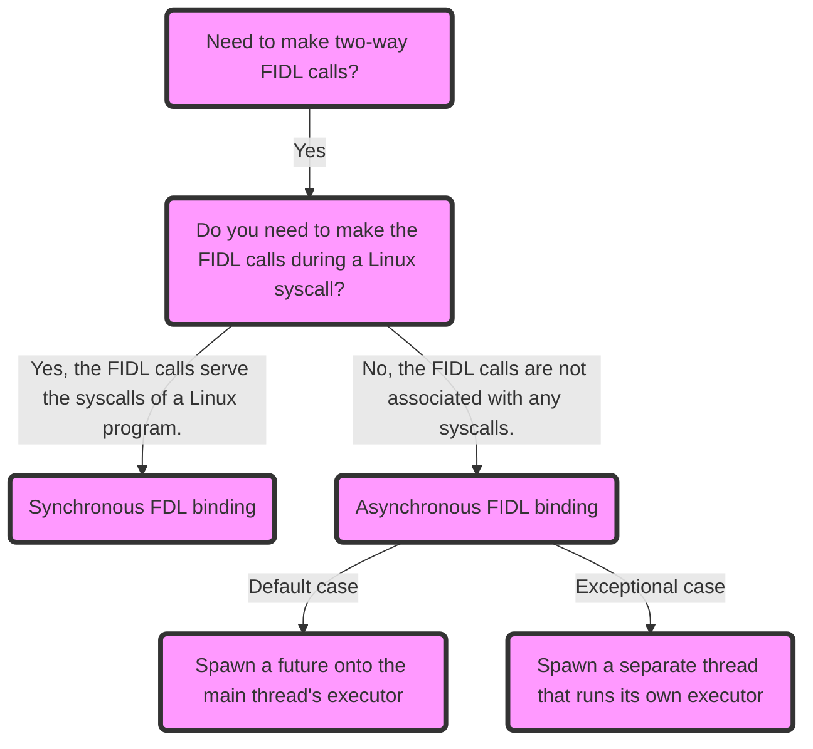

# IPC patterns in Starnix

This guide contains best practices for helping Fuchsia developers navigate the
tradeoffs of using various Inter-Process Communication (IPC) patterns in
[Starnix][starnix-concepts].

Best practices for making FIDL calls in Starnix:

- [Selecting FIDL bindings in Starnix](#selecting-fidl-bindings-in-starnix)
- [Selecting namespaces in Starnix](#selecting-namespaces-in-starnix)

And for the practical implementations of the best practices outlined in the
guide, see [Code examples](#code-examples).

## Selecting FIDL bindings in Starnix {:#selecting-fidl-bindings-in-starnix}

This section provides a decision tree to assist developers in selecting between
synchronous and asynchronous FIDL bindings.

Asynchronous FIDL calls cannot be invoked directly from a Starnix syscall. This
is because a thread in Starnix needs to return control back to Linux. This means
there's no way to register an asynchronous callback handler in Starnix.

Instead, consider one of the following patterns for making asynchronous FIDL calls
in Starnix:

- Do everything synchronously in a syscall handler.
- Spawn a future on the main executor.
- Spawn your own thread with an executor.



**Figure 1**. This flowchart visualizes the decision-making process for
selecting FIDL bindings in Starnix.

**What should I consider when choosing one of these patterns?**

- Select **synchronous FIDL binding** for the FIDL calls that serve the syscalls
  of a Linux program.

  This is generally the **default** approach. It applies when the FIDL call needs
  to be made from a "user" thread that is servicing the syscalls of a Linux
  program. For code examples, see
  [**Synchronous FIDL binding in Starnix**](#synchronous-fidl-binding).

  However, keep in mind that if a request can be blocked for a non-trivial amount
  of time, the Starnix thread making the request, which is blocked, cannot be
  killed by a Linux signal. The Zircon team is working on adding a mechanism for
  interrupting a thread that is blocked in a `zx_channel_call`. But until Starnix
  supports such a mechanism, you need to be careful about when to block Starnix
  threads in synchronous FIDL calls.

- Select **asynchronous FIDL binding** for the FIDL calls that are not
  associated with any syscalls.

  In particular, consider the following cases:

  - Multiple calls need to be composed and waited on concurrently.
  - The FIDL protocol is meant to wake the
    [container](#selecting-namespaces-in-starnix) from suspend.
  - The FIDL protocol uses features that are difficult to implement in
    synchronous bindings, such as requiring it to serve another protocol.
  - The operation needs to be interruptible by a signal from another Linux
    thread. If a FIDL call needs to be interruptible, it can't be a synchronous
    call; you need to be able to block the syscall thread on a `Waiter` so that
    it can receive signals.

  For asynchronous FIDL binding, there are **two thread spawning techniques** to
  consider:

  - **Spawning a future onto the main thread's executor**, which is generally the
    **default** case. For code examples, see
    [**Spawn a future directly onto the main thread's executor**](#spawn-a-future-directly).

  - **Spawning your own thread**, which is an exceptional case that is useful
    because the developer gets control over when the executor runs, and it is
    possible to mix synchronous and asynchronous work on the same thread without
    blocking asynchronous work spawned by other parts of Starnix. For code
    examples, see
    [**Spawn a separate thread that runs its own executor**](#spawn-a-separate-thread).

## Selecting namespaces in Starnix {:#selecting-namespaces-in-starnix}

This section clarifies the use of kernel and container namespaces for accessing
FIDL protocols in Starnix.

A single Starnix program instance acts as two components: one is the **kernel
component** (run by the [Starnix runner][starnix-runner] and the other is the **container
component** (run by the kernel component). This means there are two places where
capabilities may be routed to be consumed by the same program. The API to use
here depends on where the capability is routed. (For more information on the
namespaces in Starnix, see
[Making Linux syscalls in Fuchsia][making-linux-syscalls].

Consider the following namespaces in Starnix that can provide access to FIDL
protocols:

- **Kernel namespace** - This namespace is accessible with normal
  `fuchsia_component` calls.
- **Container namespace** - For code examples, see
  [Container namespace in Starnix](#container-namespace).

## Code examples {:#code-examples}

This section provides code examples illustrating the different IPC patterns
described in this guide:

- [Synchronous FIDL binding in Starnix](#synchronous-fidl-binding)
- [Asynchronous FIDL binding in Starnix](#asynchronous-fidl-binding)
- [Container namespace in Starnix](#container-namespace)

These examples are sourced from various parts of the Starnix kernel for
providing practical implementations of the best practices outlined in the guide.

### Synchronous FIDL binding in Starnix {:#synchronous-fidl-binding}

This section includes code examples that illustrate the standard approach for
handling FIDL calls directly from within syscall handlers, representing a
typical implementation of synchronous FIDL binding.

A code example that connects to a synchronous proxy in Starnix:

```rust {:.devsite-disable-click-to-copy}
// Check whether we actually have access to a role manager by trying to set our own
// thread's role.
let role_manager = connect_to_protocol_sync::<RoleManagerMarker>().unwrap();
let role_manager = if let Err(e) =
    set_thread_role(&role_manager, &*fuchsia_runtime::thread_self(), Default::default())
{
    log_warn!("Setting thread role failed ({e:?}), will not set thread priority.");
    None
} else {
    log_info!("Thread role set successfully.");
    Some(role_manager)
};
```

(**Source**: [`//src/starnix/kernel/runner/container.rs`][container-rs])

A code example that uses a synchronous proxy in Starnix:

```rust {:.devsite-disable-click-to-copy}
pub fn set_thread_role(
    role_manager: &RoleManagerSynchronousProxy,
    thread: &zx::Thread,
    policy: SchedulerPolicy,
) -> Result<(), Errno> {
    let role_name = policy.kind.role_name();
    log_debug!(policy:?, role_name; "setting thread role");
    let thread = thread.duplicate_handle(zx::Rights::SAME_RIGHTS).map_err(impossible_error)?;
    let request = RoleManagerSetRoleRequest {
        target: Some(RoleTarget::Thread(thread)),
        role: Some(RoleName { role: role_name.to_string() }),
        ..Default::default()
    };
    let _ = role_manager.set_role(request, zx::MonotonicInstant::INFINITE).map_err(|err| {
        log_warn!(err:?; "Unable to set thread role.");
        errno!(EINVAL)
    })?;
    Ok(())
}
```

(**Source**: [`//src/starnix/kernel/task/scheduler.rs`][scheduler-rs])

### Asynchronous FIDL binding in Starnix {:#asynchronous-fidl-binding}

The section contains code examples illustrating two different approaches for
handling asynchronous FIDL calls in Starnix:

- [**Spawn a future directly onto the main thread's executor**](#spawn-a-future-directly)
- [**Spawn a separate thread that runs its own executor**](#spawn-a-separate-thread)

#### Spawn a future directly onto the main thread's executor {:#spawn-a-future-directly}

A code example that spawns a future directly onto the executor of Starnix's main
thread:

```rust {:.devsite-disable-click-to-copy}
   current_task.kernel().kthreads.spawn_future(async move {
        let _ = {
            // 1. Lock the state to update `abort_handle` when the timer is still armed.
            // 2. MutexGuard needs to be dropped before calling await on the future task.
            // Unfortunately, std::mem::drop is not working correctly on this:
            // (https://github.com/rust-lang/rust/issues/57478).
            let mut guard = self_ref.state.lock();
            if !guard.armed {
                return;
            }

            let (abortable_future, abort_handle) = futures::future::abortable(
                self_ref.start_timer_loop(kernel_ref.kthreads.system_task(),thread_group),
            );
            guard.abort_handle = Some(abort_handle);
            abortable_future
        }
        .await;
    });
```

(**Source**: [`//src/starnix/kernel/task/interval_timer.rs`][interval-timer-rs])

#### Spawn a separate thread that runs its own executor {:#spawn-a-separate-thread}

A code example that spawns a separate `kthread` that runs its own executor:

```rust {:.devsite-disable-click-to-copy}
    kernel.kthreads.spawner().spawn(|_, _| {
        let mut executor = fasync::LocalExecutor::new();
        let scheduler = ThroughputScheduler::new();
        let mut view_bound_protocols = Some(view_bound_protocols);
        let mut view_identity = Some(view_identity);
        let mut maybe_view_controller_proxy = None;
        executor.run_singlethreaded(async move {
```

(**Source**: [`//src/starnix/kernel/device/framebuffer_server.rs`][framebuffer-server-rs])

### Container namespace in Starnix {:#container-namespace}

This section contains a code example that demonstrates the syntax for accessing
container-based FIDL protocols located within the container component.

A code example showing how to connect to the `CryptManagement` protocol in the
container namespace:

```rust {:.devsite-disable-click-to-copy}
    let crypt_management_proxy = current_task
        .kernel()
        .connect_to_protocol_at_container_svc::<CryptManagementMarker>()
        .map_err(|_| errno!(ENOENT))?
        .into_sync_proxy();
```

(**Source**: [`//src/starnix/kernel/vfs/file_object.rs`][file-object-rs])

<!-- Reference links -->

[starnix-concepts]: /docs/concepts/starnix/README.md
[starnix-runner]: /docs/concepts/starnix/starnix-container.md#starnix-container-starnix-kernel-and-starnix-runner
[making-linux-syscalls]: /docs/concepts/starnix/making-linux-syscalls-in-fuchsia.md
[container-rs]: https://cs.opensource.google/fuchsia/fuchsia/+/main:src/starnix/kernel/runner/container.rs;l=480-482;drc=fde67e1fbce7b2e77ad28e14b34b80e9b95c5ee0
[scheduler-rs]: https://cs.opensource.google/fuchsia/fuchsia/+/main:src/starnix/kernel/task/scheduler.rs;l=292-307;drc=e67d59f9bc9c30490cff16b773334cc8d834cf61
[interval-timer-rs]: https://cs.opensource.google/fuchsia/fuchsia/+/main:src/starnix/kernel/task/interval_timer.rs;l=269-287;drc=e67d59f9bc9c30490cff16b773334cc8d834cf61
[framebuffer-server-rs]: https://cs.opensource.google/fuchsia/fuchsia/+/main:src/starnix/kernel/device/framebuffer_server.rs;l=294-300;drc=4b45d8aad3e4e4c9aa489ade9b900077ad304170
[file-object-rs]: https://cs.opensource.google/fuchsia/fuchsia/+/main:src/starnix/kernel/vfs/file_object.rs;l=1023-1027;drc=ff18907ed445884c022aaeb64d1618b7f11b1696
