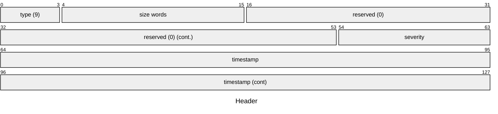
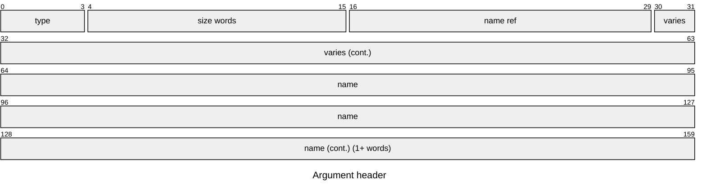
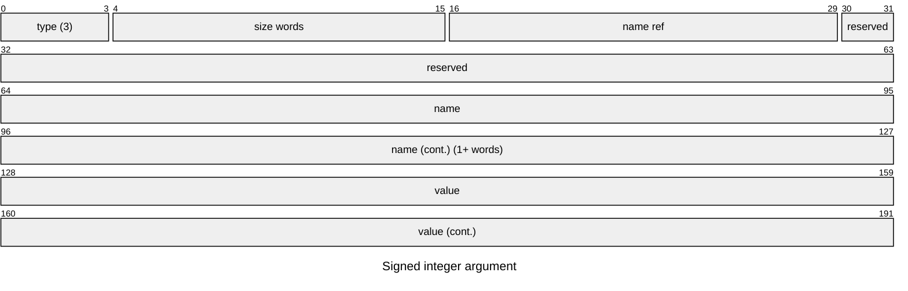
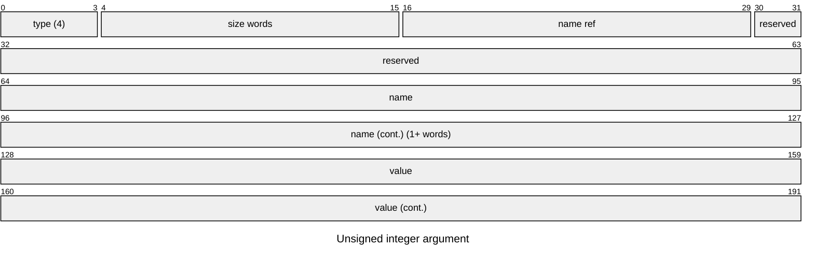
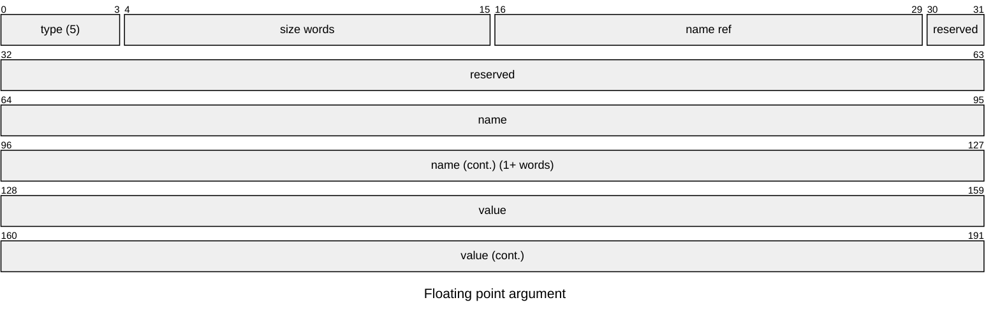
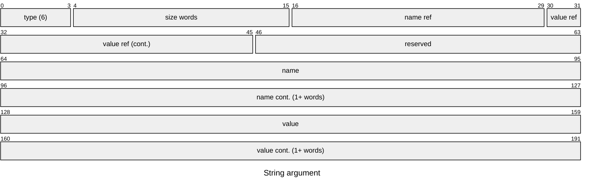
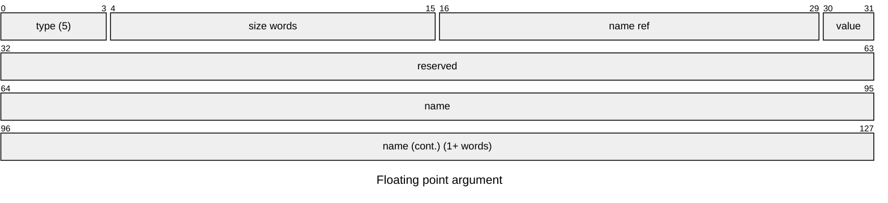

# Encoding structured records

Fuchsia uses a wire format for structured logs inspired by its [trace format]. This transmission
format allows consumption and propagation of arbitrary data structures as log records.

## Validation

The size of a log record is capped at 32kb.

Writers that send oversize or invalid records to the diagnostics service will have their streams
closed and an error recorded by the diagnostics service.

## Primitives

Integers have little endian encoding. Signed integers are twos-complement.

Timestamps are signed 64-bit integers measured in nanoseconds, as recorded by
[`zx_clock_get_monotonic`].

Strings are denoted by a 16-bit "string ref". If the most significant bit (MSB) is 0, the string is
empty. If the MSB is 1, the remaining bits of the ref indicate the length of the subsequent UTF-8
byte stream. All string refs with an MSB of 0 other than the empty string are reserved for future
extensions. Strings are padded with zeroes until 8-byte aligned.

Records consist of a number of 8-byte words and are 8-byte aligned.

### Header

The required metadata for a log record are a record type, the overall length of the record, and a
timestamp. These are encoded in the first 16 bytes of a record:

Notes:

- The "size words" field includes the header word.
- The timestamp is in nanoseconds.

Currently all records are expected to have type=9. This was chosen to mirror the [trace format] but
may require a change before these records can be processed by tracing tools.
Values for severity are defined in
[/sdk/fidl/fuchsia.diagnostics/severity.fidl](https://cs.opensource.google/fuchsia/fuchsia/+/main:sdk/fidl/fuchsia.diagnostics/severity.fidl)

## Arguments

Log record data is conveyed via a list of typed key-value pairs. The keys are always non-empty
strings, which supports different types of arguments, and the values can have several types.

### Argument header

Each argument has an 8-byte header, followed by the argument name, followed by the argument's value.
The name is padded with zeroes to 8-byte alignment before the argument's content is written.

Notes:

- The "size words" field includes the header word.
- The "name ref" is a string ref for the argument name.
- The "varies" section varies by argument type and must be 0 if unused.
- The "name length" is "64 * nameref".
- The "name" is the name of the argument, the total length (not in diagram) is
  `namelen` and is padded to 8-byte alignment.

The first 4 bits of the argument header determine which type the argument has:

T (type) | name
---------|--------------------------
`3`      | signed 64-bit integers
`4`      | unsigned 64-bit integers
`5`      | double-precision floats
`6`      | UTF-8 strings
`9`      | booleans

### Signed 64-bit integer arguments

Signed integers are appended after the argument name is terminated.

### Unsigned 64-bit integer arguments

Unsigned integers are appended after the argument name is terminated.

### 64-bit floating point arguments

Floats are appended after the argument name is terminated.

### String arguments

Strings are encoded in UTF-8, padded with zeroes until 8-byte aligned, and appended after the
argument name.

### Boolean arguments

Booleans are appended after the `NameRef` field in the argument header.

# Encoding "legacy" format messages

Components that call [`LogSink.Connect`] are expected to pass a socket in "datagram" mode (as
opposed to "streaming") and to write the ["legacy" wire format] into it. This uses little endian
integers and a mix of length-prefixed and null-terminated UTF-8 strings.

At the moment, this is only used by the [Go logger] implementation.

[Go logger]: /src/lib/syslog/go/logger.go
[`zx_clock_get_monotonic`]: /reference/syscalls/clock_get_monotonic.md
[`LogSink.Connect`]: https://fuchsia.dev/reference/fidl/fuchsia.logger#Connect
["legacy" wire format]: /zircon/system/ulib/syslog/include/lib/syslog/wire_format.h
[trace format]: /docs/reference/tracing/trace-format.md
