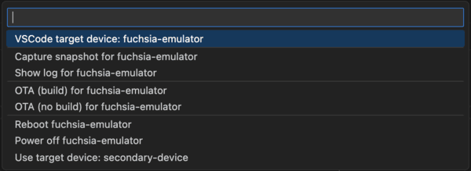
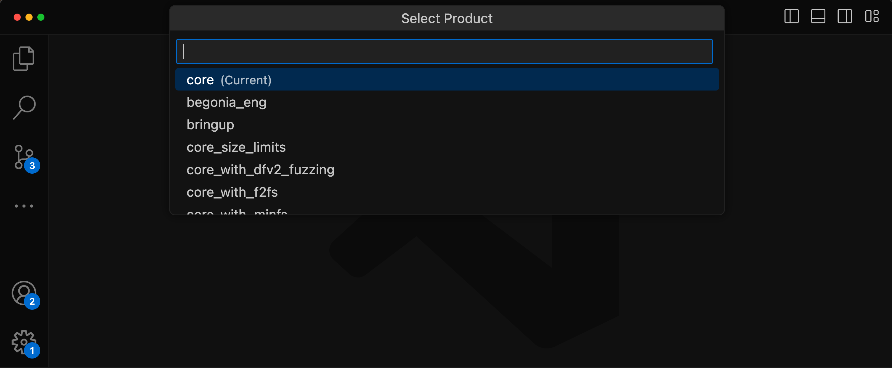
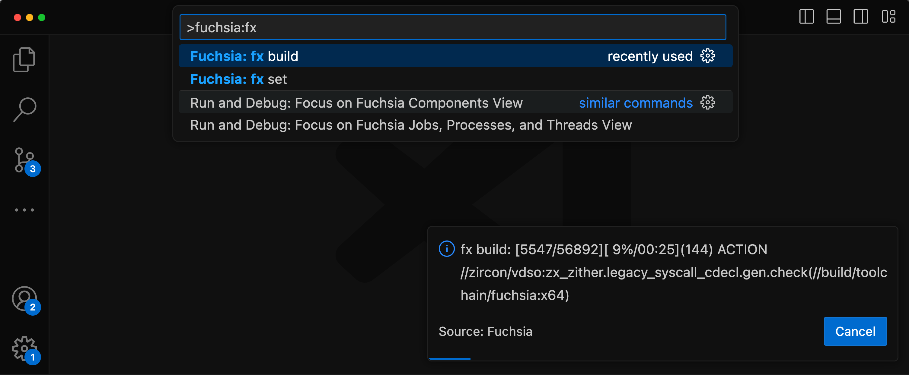
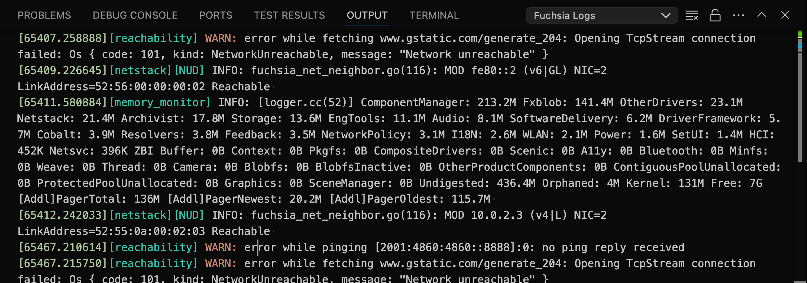
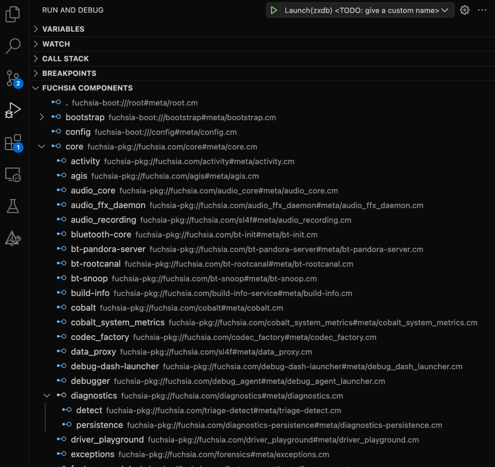
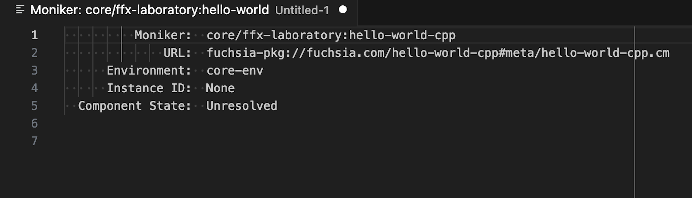
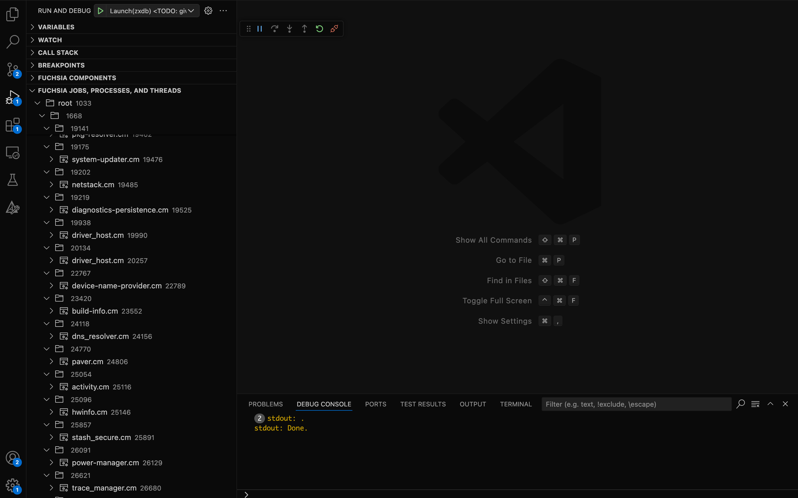



# Using the Fuchsia extension for VS Code

This extension adds support for working with Fuchsia targets and source code, including:

* Connecting to a device.
* Debugging C++ and Rust code (supported by `zxdb`).
* Analyzing logs from Fuchsia devices.

Note: To see how to perform the initial installation and configuration of the
extension, see [Installing the Fuchsia extension for VS Code][fuchsia-dev-ext].

## Compatibility

The Fuchsia extension is compatible with ffx `9.20220803.3.1` and forward.

## Edit code

By default, VS code provides syntax highlighting, errors and warnings,
jumping to a definition, and lists references for C++.

Note: The Fuchsia extension does not directly implement support for C++
editor. Instead, it relies on additional VS Code extensions for that functionality.

VS Code actively analyzes your code in the background and can show you various
warnings or errors. For more information, see
[Errors and warnings][vscode-errors]{: .external}.

The Fuchsia extension also provides syntax highlighting for
[FIDL][fidl-docs] and [CML][cml-docs].

## Configure and build Fuchsia

Tip: The VS Code command palette is accessible with `Ctrl+Shift+P`
(Linux/Windows) or `Cmd+Shift+P`(Mac).

Set your Fuchsia build configuration through the command palette and select
**Fuchsia: fx set**.



You can select products and boards available from a dropdown list. The extension
displays a message when `fx set` finishes running.



To build Fuchsia through the command palette, select **Fuchsia: fx build**. The
extension displays a progress bar while the build is in progress.



Tip: Set `fx build` as the default build task to run with `Ctrl+Shift+B`
(Linux/Windows) or `Cmd+Shift+B` (Mac). For a custom keyboard shortcut, assign
one in Preferences:Keyboard Shortcuts.

## Connect to a Fuchsia device

The Fuchsia extension allows you to connect to a Fuchsia target which
can be a physical device or an emulator. The extension supports multiple
target devices and allows you to easily switch between various Fuchsia devices.
You can only connect to a single device at any given time.

Note: For more information on getting started with the Fuchsia SDK and starting
an emulator, see [Get started with the Fuchsia SDK][get-started-sdk]{:.external}.

If your emulator is properly configured and started, you should see a
<span class="material-icons">computer</span> and the
name of your Fuchsia device in the status bar of VS Code. If you are using
the emulator and not seeing a Fuchsia device, see
[Start the Fuchsia emulator][sdk-start-emulator].


### Options for a Fuchsia device

You can click the
<span class="material-icons">computer</span> and the
name of your Fuchsia device in the status bar of VS Code to see the various
options that you have for your Fuchsia devices. These options display in the
VS Code command palette. In most cases, you have the following options:


* **Default target: `<device-name>`**: This option shows which Fuchsia device is
  currently configured as your default target. If you have additional Fuchsia
  devices, click the `Set <device-name> as default` to connect to that specific
  device. This is equivalent to running `ffx target default get`.
* **Set `<device-name>` as default**: This options lets you connect to the selected
  Fuchsia device. This is equivalent to running
  `ffx target default set <device-name>`.
* **Show log for `<device-name>`**: This option opens the **Fuchsia logs** tab of
  the Fuchsia extension. For more information, see
  [View Fuchsia logs](#view-fuchsia-logs). This is equivalent to running
  `ffx log`.
* **Reboot `<device-name>`**: This options restarts your Fuchsia device. This is
  equivalent to running `ffx target reboot`.
* **Power off `<device-name>`**: This option powers off your Fuchsia device. This
  is equivalent to running `ffx target off`. If you power off a Fuchsia emulator,
  you need to use `ffx emu start <product-bundle>` to start the emulator again.
  For more information, see [Start the Fuchsia emulator][sdk-start-emulator].

## View Fuchsia logs {#view-fuchsia-logs}

The Fuchsia extension allows you to view the symbolized logs
(human-readable stack traces) for your connected Fuchsia device. This is equivalent
to running `ffx log`. For more information on `ffx log`, see
[Monitor device logs][monitor-device-logs].

Select **Fuchsia logs** from the drop-down in the **Output** tab to see the
following:

Note: When you first open the **Fuchsia logs** tab, it may take a few minutes
to load all of the available Fuchsia logs. If no logs display, it may be an
indication that you do not have connected a Fuchsia device or an emulator.




### Clearing the Fuchsia logs

Once the Fuchsia extension has streamed the Fuchsia logs, you can
clear the listed Fuchsia logs to see the incoming logging events for your Fuchsia
device.

To clear the Fuchsia logs, click the <span class="material-icons">
playlist_remove</span> in the top right corner of the **Fuchsia logs**
tab.

### Auto-scrolling Fuchsia logs

To toggle auto-scroll for Fuchsia logs, click the
<span class="material-icons">lock</span> in the top right corner of the
**Fuchsia logs** tab.

## Debug code

The Fuchsia extension allows you to run the Fuchsia debugger,
[zxdb][zxdb-docs]. This integrates the zxdb debugger into the VS Code IDE to
let you set break points and other debugger settings as you are working with
source code.

### Configure a profile

Before you start using the debug console, you need to create a debugging profile.
You can create several debugging profiles and then easily toggle between each
profile.

To create a debugging profile:

1. In VS Code, open **Run and Debug** (this option is in the left side-bar and
   has a play and bug icon).

   

1. From the **Run and Debug: Run** panel, click **Show all automatic debug
   configurations**. Then, from the command palette, select **Add Config (fuchsia)**.
   The editor will open a `launch.json` file.
1. The editor should display a list of prepopulated debugging profiles, select
   any of the profiles that start with `zxdb`.

   Modify the key/values as needed for your debugging profile. Before you edit
   the profile, consider the following:

   Note: You can save this profile file into a personal repository so that you
   can use the same settings across multiple instances of VS Code.

   * `name`: Specify a meaningful identifier for the profile.
   * `type`: Specify `zxdb`. This is the only Fuchsia debugger.
   * `request`: Specify `launch`. This is the only valid option.
   * `launchcommand`: Specify the alias or path to the ffx binary and append
     any options and parameters. In most cases, this will be a `ffx component
     run ....`. For more information, see [Run components][run-components].
   * `process`: Specify the name of the component that you are debugging.

   Note: If you have not set a system alias for the `ffx` tool, you need to
   specify the path of the `ffx` binary for the `launchCommand` key. If you
   use a relative path, make sure to navigate to the correct directory from
   your terminal. For example `cd ~/fuchsia-getting-started`.

1. Once you have added the values for your profile, `launch.json` should look
   similar to the following:

       ```json5
       {
         "configurations": [
         {
          # Specify a meaningful identifier.
          "name": "Debug examples",
          # This is a fixed required value.
          "type": "zxdb",
          # This is a fixed required value.
          "request": "launch",
          # Specify the desired launchcommand.
          "launchCommand": "tools/ffx component run /core/ffx-laboratory:hello_world fuchsia-pkg://fuchsiasamples.com/hello_world#meta/hello_world.cm --recreate",
          # Specify the process that you want to debug.
          "process": "hello_world"
        }
        ]
      }
      ```

1. Save the changes that you made to the `launch.json` file.

You have successfully created a debugging profile. You can repeat the instructions
to add additional profiles.

### Run and debug

Once you have created a debugging profile, you can use your profile to
run and debug a component that you are working on.

Note: These steps are the default VS Code steps. For the complete VS Code
documentation about debugging, see [Debugging][docs-debugging-vscode]{: .external}.

To start the debugger:

1. In VS Code, open **Run and Debug** (this option is in the left side-bar and
   has a play and bug icon).
1. From the **Run and Debug: Run** panel, use the drop-down list to select
   your debugging profile. Then, click the green
   <span class="material-icons">play_arrow</span> to the left of the drop-down
   list to start the debugging session.

   

Once you have started the debugger:

* You can use the **Debug console** tab to run zxdb commands. For more
  information on zxdb console commands, see
  [Zxdb console commands and interaction model][zxdb-commands-docs].
* You can use the VS Code debugger features to perform debugging actions, add
  breakpoints, logpoints, etc... For more information, see
  [Debug actions][vscode-debug-actions]{: .external}.

## Fuchsia component explorer

The Fuchsia extension provides a tree view of components on your Fuchsia device.
This is the equivalent of running [`ffx component list`][ffx-component-list].

To view the Fuchsia component list, open **Run and Debug** (this option is in
the left side-bar and has a play and bug icon) amd expand the **Fuchsia
Components** section.



### Component details

Hover over a component in the Fuchsia component list, that displays a pop-up with
the lifecycle information for that component.

To view details of a component, click the component name in the Fuchsia
component list. This opens a new window with details of the component and is the
equivalent of running [`ffx component show <component-name>`][ffx-component-show].



### Debug a component

To debug a component, click the <span class="material-icons">bug_report</span>
to the right of the component name.

## Fuchsia task explorer

The Fuchsia extension provides a tree view of all jobs, processes, and threads
running in the Fuchsia system. To view the Fuchsia task explorer, open **Run and
Debug** (this option is in the left side-bar and has a play and bug icon) and expand
the **Fuchsia Jobs, Processes, and Threads** section.

To attach a debugger to a task, click the <span class="material-icons">bug_report</span>
to the right of the process.



[fuchsia-dev-ext]: /docs/reference/tools/editors/vscode/fuchsia-ext-install.md
[get-started-sdk]: https://fuchsia.googlesource.com/sdk-samples/getting-started
[sdk-start-emulator]: /docs/development/tools/ffx/workflows/start-the-fuchsia-emulator.md
[zx_clock_get_monotonic]: /reference/syscalls/clock_get_monotonic.md
[add-tags-logging]: /docs/development/languages/rust/logging.md#add_tags
[log-severity]: /docs/development/diagnostics/logs/severity.md
[monitor-device-logs]: /docs/development/tools/ffx/workflows/view-device-logs.md#monitor-device-logs
[zxdb-docs]: /docs/development/debugging/debugging.md
[run-components]: /docs/development/components/run.md#run
[zxdb-commands-docs]: /docs/development/debugger/commands.md
[vscode-debug-actions]: https://code.visualstudio.com/docs/editor/debugging#_debug-actions
[fidl-docs]: /docs/concepts/fidl/overview.md
[cml-docs]: https://fuchsia.dev/reference/cml
[vscode-errors]: https://code.visualstudio.com/Docs/editor/editingevolved#_errors-warnings
[diagnostics-schema]: /docs/reference/platform-spec/diagnostics/schema.md#payload
[docs-schema-logs]: /docs/reference/platform-spec/diagnostics/schema.md#logs
[docs-debugging-vscode]: https://code.visualstudio.com/docs/editor/debugging
[component-moniker]: /docs/reference/components/moniker.md
[ffx-component-list]: https://fuchsia.dev/reference/tools/sdk/ffx#ffx_component_list
[ffx-component-show]: https://fuchsia.dev/reference/tools/sdk/ffx#ffx_component_show
