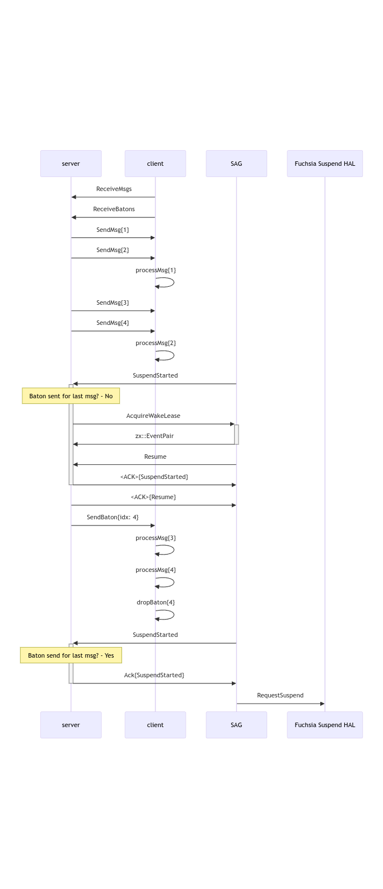
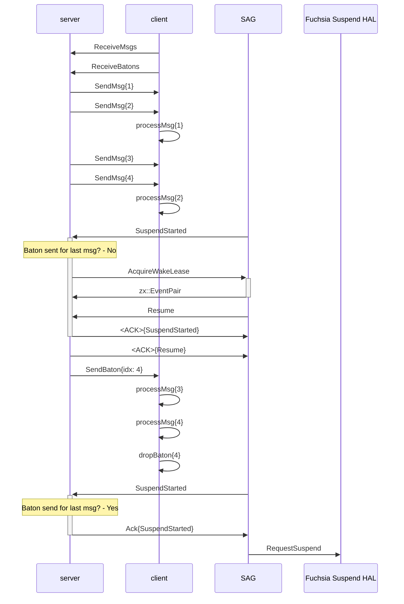

# Optimistic lease management
If you simply want to know how to use optimistic lease management, skip to
the [Using optimistic lease management for busy people](#busy-people) section.
If you want to understand more about the event flow and FIDL exchanges
implemented in `lib`, continue to the [Strategy details](#strategy-details)
section.

## Strategy details
This example demonstrates a way to manage leases with the goal of minimizing
the number of leases taken. This works by not taking a lease until there is a
callback to an ActivityGovernorListener indicating the system is suspending.
With this strategy only the server takes wake leases, which it passes to the
client at appropriate times. This is called "optimistic lease management".

In this example the domain [protocol](fidl/power.fidl) between the client and
the server is very simple. The client makes a request to the server to receive
messages and the server returns a Zircon socket which the server writes
messages to.

The client and server use a different method to pass a baton. This client uses
this method as a hanging-GET and the server only responds to it under certain
conditions. In the example code the server uses some
[library code](lib/sequence_server.rs) and client uses other
[library code](lib/sequence_client.rs) to automatically manage acquisition,
sending, receiving, and dropping batons.

The server and client implement a strategy to manage batons such that all
messages sent by the server are processed by the client prior to suspension. A
key requirement of this strategy is the client and server keep track of how
many messages have been exchanged. The library code provides interfaces for the
server and client to tell the library when messages have been sent and
processed, respectively.

The server takes a wake lease in two cases:
  * It receives an event (e.g. an interrupt) while the system is suspended
  * It is notified of suspension and sent any messages to the client since the
    last time it was notified of suspension.

The server then sends the wake lease and a message index to the client. The
[example server](src/server.rs) is only responsible for notifying the
library when it sends a message and when it receives a new hanging-GET for a
baton. The library code manages creating and sending batons at the right times.
When the client receives the message it holds on to the wake lease until it has
processed the message corresponding to the index. The
[example client](src/client.rs) is only responsible for informing the library
code when it has processed a message, the library manages the rest.

Since suspension is an asynchronous process it may be the case that more events
arrive at the server while the baton is traveling to the client and the client
completes any message processing. This means that we might go through some
number of suspend/resume callbacks from System Activity Governor while the
system quiesces.

This algorithm has some notable properties. In particular it means that the
system does not take a lease for every event, but only at system transition
points where we're going from suspended to resumed or resumed to suspended. For
many systems the number of events (e.g. network packets, touch events,
accelerometer readings, etc) is orders of magnitude greater than the number of
system state transition events.

For each processing pipeline this algorithm only requires the head component
of the pipeline, in this example "the server", to take wake leases. These
leases are then simply passed through the pipeline as required. This results
in fewer integrations with power framework which creates efficiency, but can
also present observability challenges. We expect to address these challenges
by providing standardized ways for the pipeline participants to exfiltrate
information about their receipt and passing along of leases.

Below is a diagram of how a sample flow might work where the server sends the
client a series of messages faster than the client can process them and then the
system starts to suspend.

This is the code markup for the above diagram in [Mermaid][mermaid] format.

## Using optimistic lease management for busy people {#id busy-people}
To facilitate optimistic lease management there are some helper classes for
servers and clients which are in the [lib](lib) subdirectory. The current
implementations are based on some assumptions about how servers and clients
communicate as well as what signal prompts state synchronization between the
two. This state synchronization referred to, with a nod to cache management,
as a "flush". In the future the library will likely grow to support more
client-server scenarios.

Servers probably want to use things from
[sequence_server.rs](lib/sequence_server.rs) such as `SequenceServer`. The
`SequenceServer` is effectively a builder for a `MessageSendTracker`. Servers
should follow these steps:
1. Construct a `SequenceServer`.
2. Call `SequenceServer::manage()`.
3. Asynchronously poll the future returned from (2).
4. Notify the `MessageSendTracker` returned from (2) when a message is sent.
5. Call `MessageSendTracker::set_requester` when a new baton request arrives.

The server does *not* need to mint batons or do anything related to when
suspends and resumes happen, that is handled automatically.

Clients should use [`SequenceClient`](lib/sequence_client.rs) to manage
baton-related communication with the server. The client should call
`process_message` to indicate to `SequenceClient` when the client processed a
message. The client does not need to do anything related to handling batons,
`SequenceClient` manages the hanging-GET requests for the batons and holding on
to the batons until the client tells `SequenceClient` it saw the message.
`process_message` returns a baton _if_ the message processed has an associated
baton, but the client does **not** need to retain the baton. Returning the
baton is mostly useful if a client wants to pass the baton on to a client it
may have.

[mermaid]: https://mermaid.live
